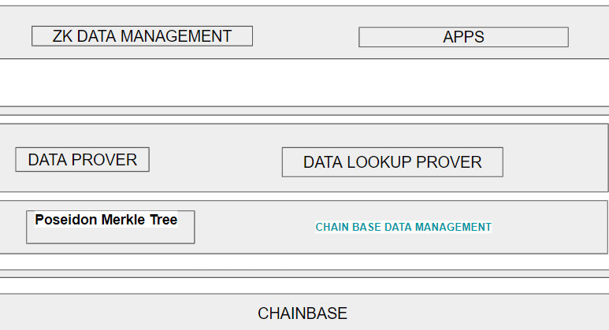

# ZK CHAINBASE

**Embracing Verifiable Computation and On-Chain Provable Data**

In the era of Web3, data holds immense importance in computational processes. A seamless transition to Web3 necessitates improved accessibility and precision of data. This is where zkchainbase steps in with zkml and zkdatabase. By employing Zero-Knowledge Proof, it guarantees the accuracy of data in a verifiable fashion.

# INTRODUCTION

By harnessing the power of blockchain and machine learning, we can develop sophisticated DeFi systems and more. However, challenges arise in terms of data availability and computational capacity within virtual machines. Chainbase addresses data concerns, while computation poses another obstacle. Traditional EVMs may not suffice for complex computational models, but this can be mitigated through zero-knowledge proofs. These proofs allow us to securely submit and verify computations on-chain. Additionally, many applications require specific data for computation. For example, if a prior user is a holder of a particular token, accessing that information may be a challenge. This is where Chainbase, with its comprehensive datasets, comes into play. We must work towards creating provable data proofs using zk technology.

# DOCUMENTATION

A machine learning model can be constructed using libraries such as TensorFlow or PyTorch. In this case, we employ the ezkl library to generate a verifier. The necessary data for model training can be gathered through the Chainbase API, and the model can be developed using the respective machine learning library. After the model is trained, the user can generate a verifier contract. An example implementation in an IPython notebook, along with a Python implementation for data fetching, has also been provided.

The user has the capability to generate a proof using the trained model. This proof can then be submitted to an on-chain verifier contract for the purpose of verifying the computation and its result.

The zkDatabase is currently in its conceptual stage and has not been fully implemented yet. Nevertheless, I have included a proof of concept (PoC) here to provide a glimpse into its potential functionality and capabilities.

This PoC serves as a demonstration of the core concepts and principles underlying the zkDatabase, giving an idea of how it might operate once it reaches full development. It's important to note that this is a preliminary representation, and the final implementation may differ upon completion.

## chain base data management

This module serves the purpose of automating the data storage process for the backend, akin to chainbase. Additionally, it handles the indexing procedure and updates the Merkle tree whenever new data is inserted.

## Poseidon Merkle Tree

The Poseidon Merkle Tree and Zero-Knowledge Proofs (ZKP) play a crucial role in establishing the immutability of the zkDatabase.

## Data Prover

This module outlines the methodology for handling data and determining the final state of the data. It provides a framework for processing and interpreting data, ensuring that we arrive at a conclusive understanding of its state.

## Lookup Prover

This module establishes a connection to a B-tree in order to verify the accuracy of the lookup process. It serves as a crucial component to safeguard against any malicious attempts by an operator to input incorrect data.

## Zkdatabase management

Here, we manage the verification of on-chain data from the application.

## Addressing Critical Challenges in Off-Chain Data Storage

The existing off-chain storage system faces several significant challenges. One prominent issue is the vulnerability to a single point of failure. Currently, data is not replicated, leaving it susceptible to permanent loss in the event of downtime or data loss by centralized cloud storage providers. This poses a serious risk for users and organizations heavily reliant on such providers, particularly when dealing with sensitive data.

Moreover, while employing Zero-Knowledge Proofs (ZKP) and Merkle trees ensures data immutability, it can hinder accessibility. Although the data is public, not everyone has the means to access it. This creates a gap where public records may need to be audited, but the underlying data remains inaccessible. To address this, there is a need to enable synchronization and accessibility of public data in addition to committing the Merkle root to the public blockchain.

Another challenge arises from inconsistent data structuring. Raw data requires organization and sorting for practical use. Leaving this task to individual zkApps may lead to irregular and non-scalable data structures. To maintain uniformity and scalability, it is crucial to adopt a standardized approach for structuring and sorting data. Otherwise, relying on separate zkApps for this process could result in fragmentation and inconsistency, complicating database management and extension efforts.

## solution

Addressing Key Challenges in Off-Chain Storage: Leveraging Distributed Storage and B-Tree Indexing

To overcome the vulnerability of a single point of failure and ensure data availability, we will harness the potential of a distributed storage engine. This engine empowers any user with a data replica to reconstruct the database and its accompanying Merkle tree, providing a robust solution for fault recovery. This approach not only introduces redundancy to prevent data loss in case of a node failure but also grants users seamless access and updating capabilities from any location, significantly enhancing overall accessibility. Additionally, the integration of Merkle trees facilitates swift and reliable verification of data integrity, enabling the quick identification and correction of any alterations or inconsistencies. This feature significantly bolsters data security, making it less susceptible to tampering or unauthorized access. In parallel, the implementation of B-tree indexing optimizes data retrieval, necessitating the establishment of a link to the Merkle tree for validation. This efficient indexing method enables swift and accurate data location within the database. To ensure the integrity of the search process, a crucial link between the B-tree and the Merkle tree is established. The Merkle tree provides cryptographic proof of data integrity and validation process serves as a robust defense against potential errors or inconsistencies in the data, enhancing the overall efficiency and reliability of the system.
